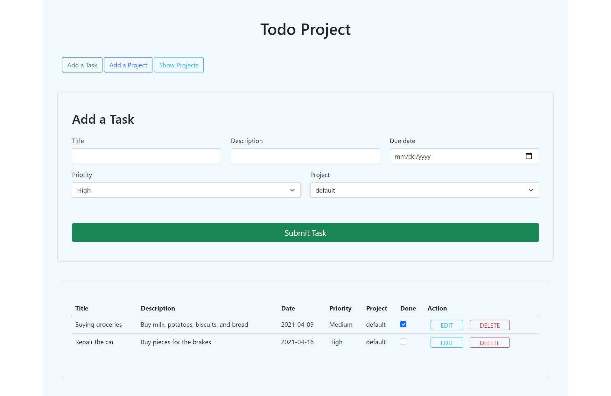

# PROJECT TODO LIST

> This project is part of the Microverse JavaScript curriculum. This application allows the user to create tasks and assign them to a project of choice, the data is stored in the localStorage of the browser.

## Built With

- JavaScript
- HTML5
- CSS3
- Bootstrap
- Webpack

## Getting Started

To get a local copy up and running follow these simple steps.

### Prerequisites

- Node.js

### Setup

- `git clone git@github.com:AshakaE/Todo-List.git`
- `cd Todo-List`
- `npm install` to get required dependencies

### Usage

- Start server with:
- In the terminal: `npm run start`

# Authors

👤 **Ashaka Egerega**

- GitHub: [@AshakaE](https://github.com/AshakaE)
- Twitter: [@shaqzee](https://twitter.com/shaqzee_)
- LinkedIn: [AshakaE](https://www.linkedin.com/in/AshakaE/)

👤 **Aymen Bida**

- GitHub: [@AymenBida](https://github.com/AymenBida)
- Twitter: [@AymenBida](https://twitter.com/AymenBida)
- LinkedIn: [AymenBida](https://www.linkedin.com/in/aymenbida/)

## 🤝 Contributing

Contributions, issues and feature requests are welcome!

Feel free to check the [issues page](https://github.com/AshakaE/Todo-List/issues).

## Show your support

Give a ⭐️ if you like this project!

## Acknowledgments

Microverse
The Odin Project

## 📝 License

Copyright 2021 Ashaka Egerega and Aymen Bida

Permission is hereby granted, free of charge, to any person obtaining a copy of this software and associated documentation files (the "Software"), to deal in the Software without restriction, including without limitation the rights to use, copy, modify, merge, publish, distribute, sublicense, and/or sell copies of the Software, and to permit persons to whom the Software is furnished to do so, subject to the following conditions:

The above copyright notice and this permission notice shall be included in all copies or substantial portions of the Software.

THE SOFTWARE IS PROVIDED "AS IS", WITHOUT WARRANTY OF ANY KIND, EXPRESS OR IMPLIED, INCLUDING BUT NOT LIMITED TO THE WARRANTIES OF MERCHANTABILITY, FITNESS FOR A PARTICULAR PURPOSE AND NONINFRINGEMENT. IN NO EVENT SHALL THE AUTHORS OR COPYRIGHT HOLDERS BE LIABLE FOR ANY CLAIM, DAMAGES OR OTHER LIABILITY, WHETHER IN AN ACTION OF CONTRACT, TORT OR OTHERWISE, ARISING FROM, OUT OF OR IN CONNECTION WITH THE SOFTWARE OR THE USE OR OTHER DEALINGS IN THE SOFTWARE.
